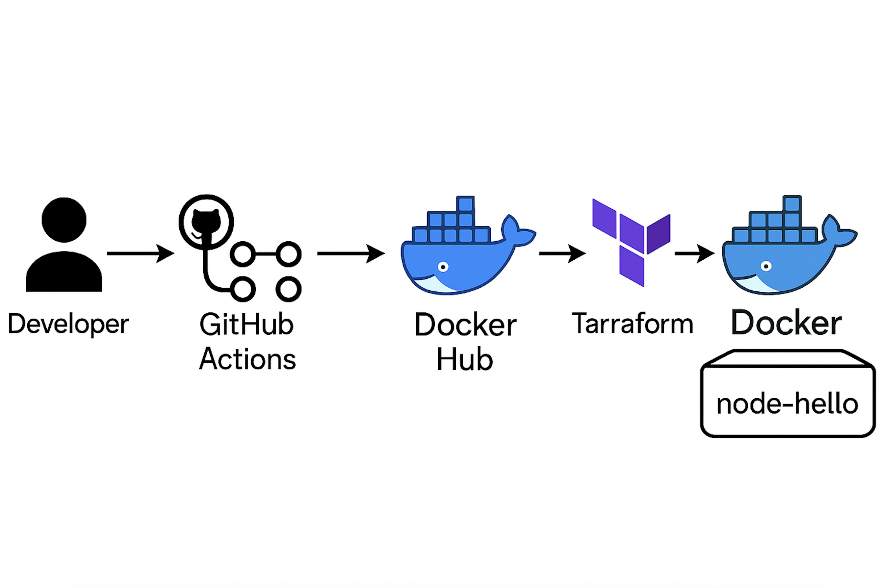

# Node Hello CI/CD Pipeline & Local Terraform Deployment

This repository demonstrates both:

1. **Automated CI/CD** using GitHub Actions to lint a Node.js app, build a Docker image with Buildx, and push it to Docker Hub.
2. **Local deployment** of the same app via Terraform using the Docker provider—no cloud required.

**Repository:** https://github.com/AhmedZeins/node-hello.git

---

## Prerequisites

- **GitHub** access to this repository
- **Docker** installed and running
- **Docker Hub** account
- **Terraform** installed (v1.6+ recommended)

---

## 1. GitHub Actions CI/CD Pipeline

The workflow file is `.github/workflows/lint-build.yml` and is named **lint&build**. It runs automatically on every push to the `master` branch, or manually via **workflow_dispatch**.

### Secrets

In your GitHub repo, add the following under **Settings → Secrets and variables → Actions**:

- `DOCKERHUB_USERNAME` — your Docker Hub username
- `DOCKERHUB_TOKEN`    — a Docker Hub access token


After a successful run, verify the image on Docker Hub under `your-username/node-hello:latest`.

---

## 2. Local Deployment with Terraform

Use Terraform and the Docker provider to pull and run your Docker image locally:

```bash
cd terraform
terraform init
terraform apply -auto-approve
```

This will:

- Pull `zeinsss/node-hello:latest` from Docker Hub.
- Start a container named `node-hello-container`.
- Map port `3000` on your host to port `3000` in the container.

Verify with:

```bash
docker ps | grep node-hello-container
```

Then visit [http://localhost:3000](http://localhost:3000).

To tear down:

```bash
terraform destroy -auto-approve
```

---
## Viewing Container Logs

After deploying the application using Terraform, you can view the container logs to monitor its activity and troubleshoot any issues. Follow these steps:

1. **Access the Container:**
   - Use the command `docker ps -a` to list all containers, including those that have exited, and find the `node-hello-container`.

2. **View Logs:**
   - Execute `docker logs node-hello-container` to display the logs for the container.

These logs provide insights into the application's runtime behavior and any potential errors.


---
## 3. AWS ECS Fargate Deployment

This section demonstrates how to deploy the application to AWS ECS Fargate using Terraform modules.

### Prerequisites

- AWS CLI configured with appropriate credentials
- Terraform (v1.6+ recommended)
- Docker image pushed to Docker Hub

### Deployment Steps

1. **Navigate to the ECS Terraform directory:**
   ```bash
   cd terraform_ECS/
   ```

2. **Initialize Terraform:**
   ```bash
   terraform init
   ```

3. **Review and apply the configuration:**
   ```bash
   terraform plan
   terraform apply 
   ```

### What This Deploys

The ECS Terraform configuration creates:

- Uses the default VPC and its subnets
- Security Group allowing inbound traffic on port 3000
- CloudWatch Log Group for container logs
- ECS Cluster
- ECS Task Definition for the Node.js application
- ECS Service running on Fargate
- IAM execution role for ECS tasks


### Clean Up

To destroy all created resources:

```bash
terraform destroy 
```

### Deployment Screenshots


*CI/CD & Terraform Architecture*


*Application Running in Container*
